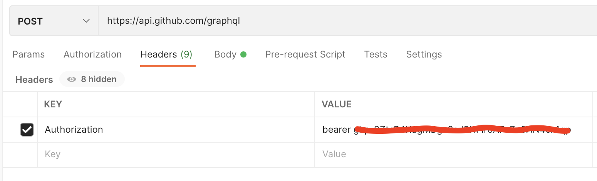

## GitHub GraphQL Explorer

URL: https://docs.github.com/en/graphql/overview/explorer

In GraphQL we have:

- Queries
- Mutations
- Subscriptions

## Query

```
query {
  	viewer {
    	name
    	url
  	}
}
```

### Pagination

```
query {
  	viewer {
    	name
    	url
    	repositories(first: 10) {
      	  nodes {
        	name
      	  }
    	}
  	}
}

```

### Postman: Using a generic client for GraphQL operations

- Create an Authorization token inside your GitHub account.
- Pass the token in the header of the POST request.



## Query with arguments

```
query {
  	organization(login: "facebook") {
    		name
    		url
  	}
}
```

## Two Identical Objects most use Alias

This wil fail

```
query {
  organization(login: "the-road-to-learn-react") {
     name
     url
  }
  organization(login: "facebook") {
     name
     url
  }
}
```

Soution is to use **Alias**

```
query {
  book: organization(login: "the-road-to-learn-react") {
     name
     url
  }
  company: organization(login: "facebook") {
     name
     url
  }
}
```

## Fragments

Share logic

```
{
  book: organization(login: "the-road-to-learn-react") {
    ...sharedOrganizationFields
  }
  company: organization(login: "facebook") {
    ...sharedOrganizationFields
  }
}

fragment sharedOrganizationFields on Organization {
  name
  url
}
```

**Note:** As you can see, you have to specify on which type of object the fragment should be used.

## Variables

```
query ($organization: String!) {
 	organization(login: $organization) {
		name
		url
	}
}
```

Variables Section:

```
{
  "organization": "facebook"
}
```

Default value to a variable

```
query ($organization: String = "the-road-to-learn-react") {
  organization(login: $organization) {
    name
    url
  }
}
```

Named query

```
query OrganizationForLearningReact(
  $organization: String!,
  $repository: String!
) {
  organization(login: $organization) {
    name
    url
    repository(name: $repository) {
      name
    }
  }
}
```

Variables Section:

```
{
  "organization": "the-road-to-learn-react",
  "repository": "the-road-to-learn-react-chinese"
}
```

## Directives

A directive can be used to query data from your GraphQL API in a more powerful way, and they can
be applied to fields and objects. Below, we use two types of directives: an **include directive**, which
includes the field when the Boolean type is set to true; and the **skip directive**, which excludes it
instead.

```
query OrganizationForLearningReact(
  $organization: String!,
  $repository: String!,
  $withFork: Boolean!
) {
  organization(login: $organization) {
    name
    url
    repository(name: $repository) {
      name
      forkCount @include(if: $withFork)
    }
  }
}
```

Variables Section:

```
{
  "organization": "the-road-to-learn-react",
  "repository": "the-road-to-learn-react-chinese",
  "withFork": true
}
```
